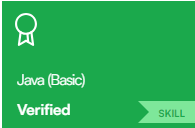
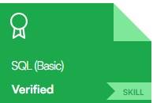

  
  
  

---

### 👨‍💻 About Me

- 💼 Full-Stack Developer, currently building an **internal ERP system** and a **customer-facing web platform** at Labone Scientific
- 🚀 Also building a personal side project: a **multi-platform Booking system** (NestJS + Next.js + Docker)
- 🎓 Software Engineering graduate (2025), Ho Chi Minh City University of Industry and Trade (HUIT)
- 🌱 Currently sharpening my skills in **NestJS, Docker, and system architecture**
- 📫 Reach me on [Facebook](https://www.facebook.com/MDwc14) or via email: leminhduc5732@gmail.com

---

### 🚀 Featured Projects

**🏢 Booking Platform (Multi-Platform)** — *Personal project, 07/2026 – Present*
A booking system deployed consistently across three surfaces: an internal ERP admin dashboard, a public-facing customer website, and a mobile app — all sharing a single unified API.
- Designed and built the backend with **NestJS + Prisma**, containerized with **Docker**, serving multiple clients through one API.
- Built the **ERP admin dashboard** and **public-facing website** with Next.js + TypeScript, keeping shared logic and UX consistent across platforms.
- Focused on multi-platform architecture: scalability and data consistency across all clients.
- `NestJS` `Next.js` `TypeScript` `Prisma` `Docker`

📦 Repos:
[Backend](https://github.com/Minhdwc/BE-booking-sport) · [ERP Frontend](https://github.com/Minhdwc/website_booking_FE_ERP) · [Public Frontend](https://github.com/Minhdwc/public-user-booking-FE)

---

**🏭 ERP System — Labone Scientific** — *10/2025 – Present*
Enterprise ERP system for internal operations, supporting multiple business modules and concurrent users.
- Developed and maintained frontend + backend features end-to-end.
- Built RESTful APIs with **Node.js/Express**, integrated **Prisma ORM**.
- Implemented real-time features with **WebSocket/Socket.IO**.
- `ReactJS` `Node.js` `Express.js` `Prisma` `Socket.IO` `AWS S3`

🔒 Company product — source is private, happy to walk through a live demo on request.

---

**🛍️ Sales Consulting Website — Labone Scientific** — *12/2025 – Present*
Customer-facing website for service consulting and product presentation.
- Built responsive UI with Radix UI + Tailwind CSS.
- Managed state with **Zustand**, forms with **React Hook Form + Zod**.
- Integrated APIs and optimized SEO (Next.js, next-sitemap).
- `Next.js` `TypeScript` `Tailwind CSS` `Zustand`

🔗 [labone.net.vn](https://labone.net.vn/)

---

### 🛠 Languages & Tools

  
  
  
  
  
  
  
   
  
  
  
  
  
  

---

### 🎓 Certificates

---

### 📊 GitHub Stats

<table>
  <tr>
    <td></td>
    <td></td>
  </tr>
</table>

  

